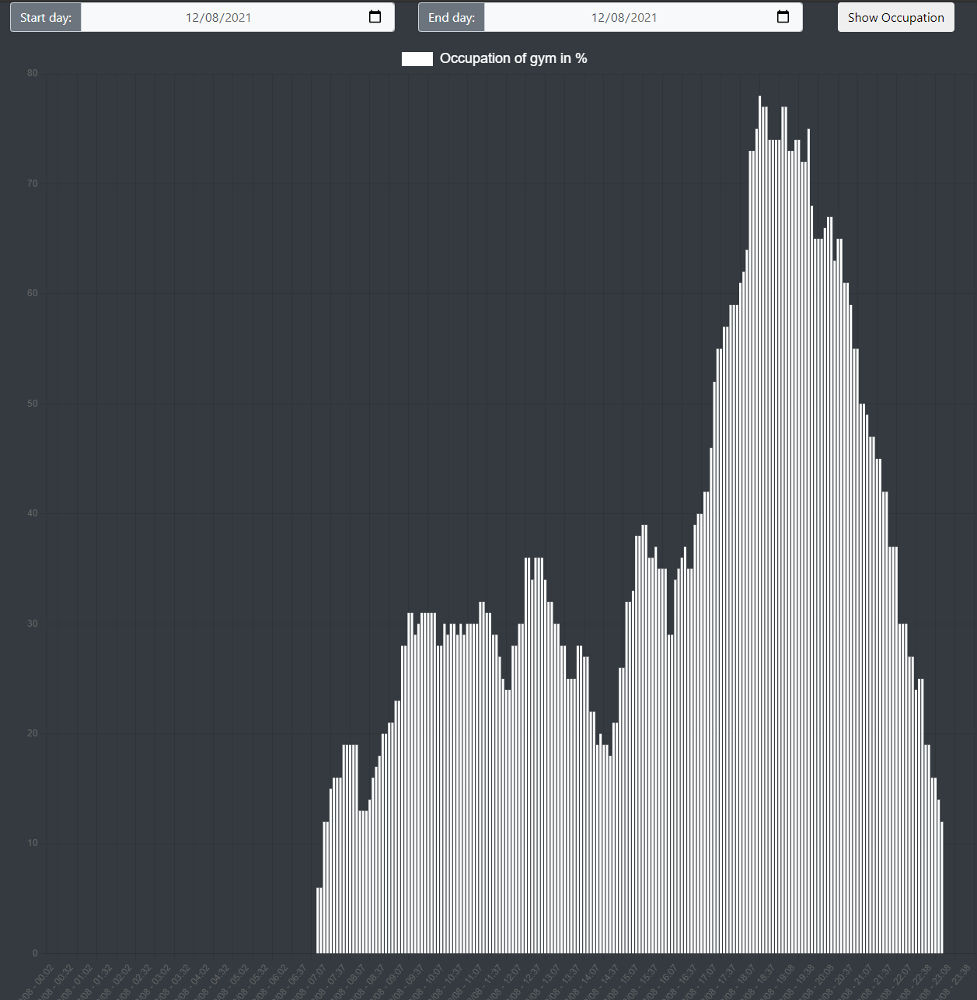

## Gym Occupation

### Data Extraction: (/data_collection)
- grabs data by building the whole webpage using puppeteer + node
- extracts the occupation of my gym
- saves it to a mySQL database on the backend

### Backend: (/server)
- serves static website (Express)
- handles requests to mySQL database (json)

### Frontend: (/client)
- displays data and sends requests for data to backend

### Hosted at: 
<https://jonas-milkovits.com/gym-occupation>

